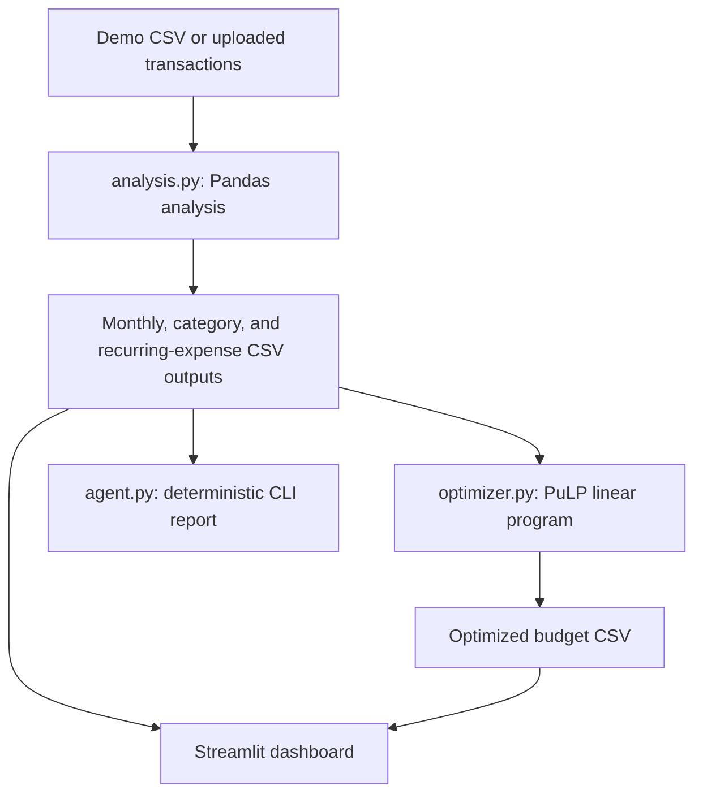

# SmartBudget Agent

SmartBudget is a personal-finance portfolio project that analyzes transaction history and uses linear programming to recommend a feasible monthly budget. It combines Pandas-based analysis, recurring-expense detection, PuLP constraints, and an interactive Streamlit dashboard.

> **Note:** The repository contains a deterministic `BudgetAgent` reporting module. It does not currently use an LLM or external tool-calling API; the dashboard's recommendations are derived from the analysis and optimization outputs.

## Overview

A spending total alone does not show which expenses can realistically change. SmartBudget turns historical transactions into category-level monthly averages, identifies recurring payments, and finds the closest feasible plan that meets a chosen reduction target. Essential and protected categories retain defined spending floors rather than being reduced to zero to satisfy a target.

## Key Features

- Transaction-level analysis by month and category
- Reproducible synthetic demo data generation
- Recurring-expense detection using payment frequency and amount variability
- Linear-programming budget recommendations with PuLP
- Category-specific minimum and maximum spend constraints
- User-defined protected categories and category amount overrides
- Feasibility feedback when a target cannot be met
- Streamlit dashboard with CSV import, comparisons, charts, and action plan
- Regression tests for target, override, and infeasible-budget behavior

## Architecture



`analysis.py` produces the data summaries used by the optimizer. `optimizer.py` makes the numerical recommendation. `app.py` calls those scripts and renders their results. `agent.py` is a separate, deterministic command-line narrative report; it is not called by the Streamlit app and does not use an LLM.

## How the Optimization Works

For each spending category \(c\), the model chooses a continuous decision variable \(x_c\): recommended monthly spending.

- **Objective:** minimize the largest proportional reduction across categories. This distributes unavoidable cuts as evenly as the category bounds allow, rather than concentrating them in an arbitrary category.
- **Budget constraint:** total recommended spending must be no greater than the requested budget. A percentage target converts to `current monthly average × (1 − savings target)`.
- **Category bounds:** each category has an allowed minimum and maximum fraction of its current average. Housing, health insurance, subscriptions, and AI tools are fixed; essentials such as groceries and utilities have higher floors. Transportation, delivery, travel, and other categories retain non-zero allowances.
- **Protected categories:** selected categories are fixed at their current average for that optimization run.
- **Recurring expenses:** detected recurring amounts create a lower bound, so the model cannot recommend spending below those commitments.
- **Feasibility:** if the requested budget is lower than the combined floors, the solver exits with the minimum feasible budget instead of writing an unrealistic solution.

The model deliberately makes simplified assumptions: category floors are policy choices, not individualized financial advice.

## Inputs

- A CSV with `category`, `description`, `amount`, and `date` columns, or the included demo data
- Monthly income (dashboard context and affordability feedback)
- Housing and beauty monthly amounts (profile-based optimizer overrides)
- Spending-reduction target (5–50% in the dashboard, or a CLI percentage/budget)
- Protected categories

## Outputs

- Monthly totals and rolling average: `data/monthly_summary.csv`
- Category totals and five largest transactions
- Detected recurring payment candidates: `data/recurring.csv`
- Optimizer input and category-level recommendation CSVs
- Monthly and category visualizations in `output/`
- Current-vs-optimized dashboard comparison and deterministic recommendations

## Example Scenario

Suppose historical average spending is **₺60,000/month** and the user selects a **20% reduction** target. The optimizer sets a ₺48,000 ceiling, keeps housing and health insurance unchanged, preserves at least 75% of grocery spending, and reduces flexible categories only within their allowed limits. If the committed and minimum category amounts already exceed ₺48,000, it reports the minimum feasible total rather than forcing a misleading plan.

## Tech Stack

- Python
- Pandas and NumPy-style data workflows
- Matplotlib
- PuLP / CBC linear programming solver
- Streamlit
- `unittest`

## Project Structure

```text
Smart-Budget-Agent/
├── app.py                 # Streamlit interface
├── analysis.py            # Transaction analysis and recurring detection
├── optimizer.py           # PuLP optimization model
├── agent.py               # Deterministic CLI narrative report
├── generate_data.py       # Synthetic demo-data generator
├── compare_budgets.py     # CLI comparison utility
├── test_optimizer.py      # Optimizer regression tests
├── data/                  # Demo inputs and generated CSV outputs
├── output/                # Generated PNG charts
├── requirements.txt
└── README.md
```

## Installation

```bash
git clone <your-repository-url>
cd Smart-Budget-Agent
python -m venv .venv
source .venv/bin/activate
python -m pip install -r requirements.txt
```

On Windows, activate the environment with `.venv\Scripts\activate`.

## Running the Application

Generate (or refresh) the demo data and analysis, then start Streamlit:

```bash
python generate_data.py
python analysis.py
streamlit run app.py
```

Useful CLI commands:

```bash
python optimizer.py --savings-pct 0.20 --protected-categories "Beauty,Housing"
python compare_budgets.py
python agent.py
```

## Running Tests

```bash
python -m unittest test_optimizer.py
```

## Limitations

- Included transactions are synthetic demo data; there is no bank integration.
- Recurring-payment detection is heuristic and benefits from longer transaction histories.
- Category floors are generalized assumptions and should be tailored to the user.
- The project does not currently include an LLM or API-based agent/tool-calling workflow.
- Results are educational budgeting scenarios, not financial advice.

## Future Improvements

- Bank-export integrations and automatic category mapping
- Forecasting from longer transaction histories
- User-configurable category bounds and multi-objective optimization
- An optional LLM explanation layer grounded strictly in deterministic tool outputs
